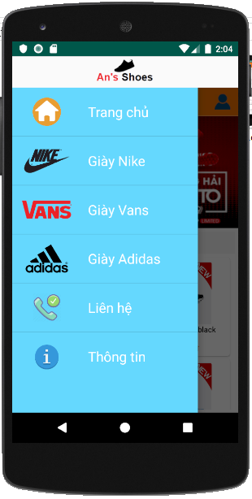
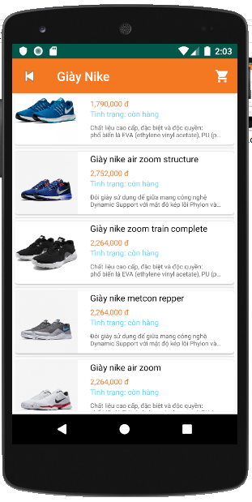
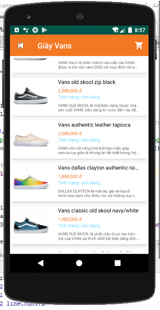
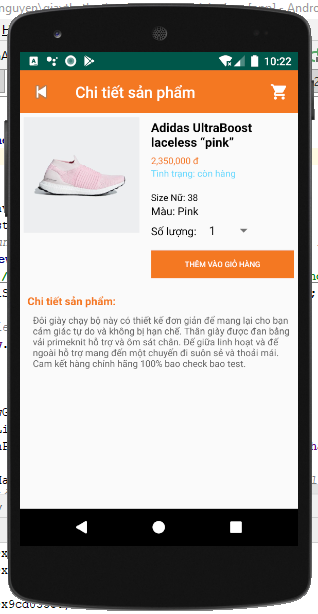
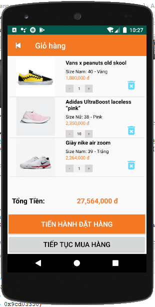
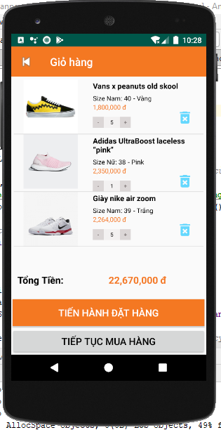
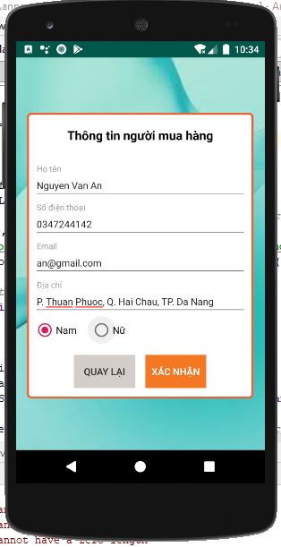
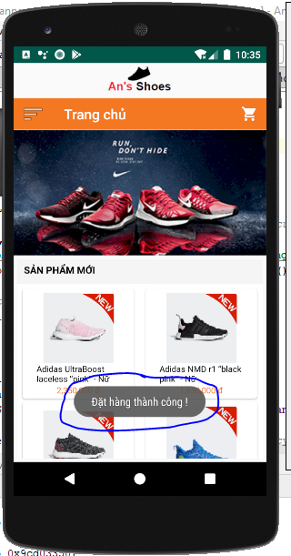
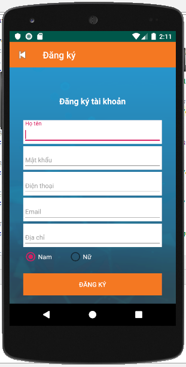
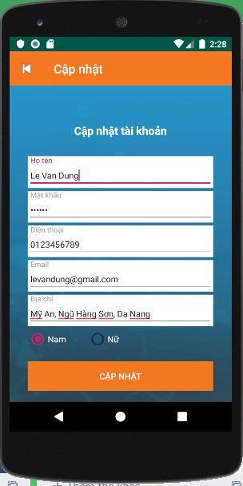

# 
Bài tập Lập Trình Di Động

# Platform
- IDE: Android Studio 3.5.0.0
- Database: MySQL

# Chức năng
a. Hiển thị giao diện trang chủ có các sản phẩm mới nhất 
b. Hiển thị menu có các loại sản phẩm khi click vào toolbar 
c. Hiển thị các sản phẩm khi click vào một loại sản phẩm nào đó 
d. Hiển thị trang chi tiết sản phẩm 
e. Hiển thị giỏ hàng khi click icon giỏ hàng 
f. Chức năng đặt hàng 
g. Chức năng đăng nhập tài khoản khách hàng 
h. Hiển thị thông tin tài khoản khách hàng 
k. Chức năng đăng ký tài khoản khách hàng 
l. Chức năng cập nhật thông tin tài khoản khách hàng 

# View
#### 1. Trang chủ

	<kbd>
		
	</kbd>

#### 2. Menu

	<kbd>
		
	</kbd>

#### 3. List sản phẩm theo loại

	<kbd>
		
	</kbd>
	<kbd>
		
	</kbd>
	<kbd>
		
	</kbd>

#### 4. Chi tiết sản phẩm

	<kbd>
		
	</kbd>

#### 5. Giỏ hàng

	<kbd>
		
	</kbd>

#### 6. Cập nhật giỏ hàng

	<kbd>
		
	</kbd>

#### 7. Đặt hàng

	<kbd>
		
	</kbd>
	<kbd>
		
	</kbd>

#### 8. Đăng nhập

	<kbd>
		
	</kbd>

#### 9. Hiển thị thông tin tài khoản

	<kbd>
		
	</kbd>

#### 10. Đăng ký

	<kbd>
		
	</kbd>

#### 11. Cập nhật tài khoản

	<kbd>
		
	</kbd>

